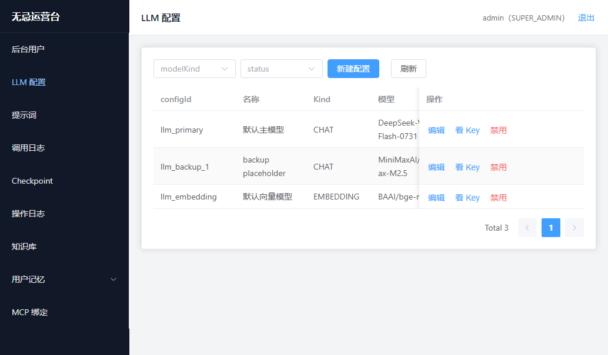

# wuji-assistant-agent

企业级 **AI 智能聊天基础平台**：OpenAI Compatible 对话、Agentic RAG、有界 ReactAgent、MCP 工具、短/长期记忆、录音分析（VTA），以及 ChatGPT 式前端。

仓库**无 Maven parent 聚合**——各 Java 子工程独立 `pom.xml`；前端为 Next.js（npm）。运营管理台在旁路仓库 `wj-assistant-agent-manage`（**源码未对本仓库开放**，能力示意见下文截图）。

---

## 功能总览

| 能力 | 说明 |
|---|---|
| 大模型对话 | 流式 `POST /api/chat/stream`（SSE）与非流式 `POST /api/chat`；User JWT 鉴权 |
| Agentic RAG | `knowledge_retrieval` 工具 + 可选预检索；PGVector / Elasticsearch Hybrid 二选一 |
| Agent 编排 | Spring AI Alibaba `ReactAgent` + `ModelRouter` 主备；有界轮次，禁止无限循环 |
| MCP | 独立 `assistant-mcp-server`；Client 按库表动态 SSE 连接与工具绑定 |
| 记忆 | 短期窗口/摘要 + 长期画像/语义记忆（Action 写入、Router 按需入模） |
| 录音分析 VTA | 独立进程 Graph：客户/销售标签、小记、意向度、汇总 |
| 可观测 | OpenTelemetry + 全量入模审计表 `llm_call_log` |
| 聊天前端 | Next.js：Thinking / 知识引用 / 工具可解释面板 |

## 系统难点与设计亮点

这些点是本仓库真正的工程含量，而不只是「接一个 Chat API」：

1. **多独立工程 + 单向依赖**  
   无 parent POM；`assistant-agent-server` → `ai-agent-core` → `ai-memory` / `ai-rag` / `ai-common`；MCP Server **禁止**依赖 Agent/Memory/RAG，避免进程耦合。

2. **双轨鉴权、职责拆分**  
   聊天进程只认 **User JWT**，禁止信任前端 `userId`；`/api/admin/**` 已迁出管理仓（Admin JWT）。本仓不暴露运营写接口。

3. **有界 Agent + 主备路由**  
   `ModelRouter` 仅路由 `llm_config` 的 `CHAT` 行；`ReactAgent` 设 `max-model-calls` / `max-tool-rounds`，达上限返回 `AGENT_MAX_ITERATIONS`；Checkpoint 用 PostgresSaver。

4. **记忆：短长期配合，而非「全量聊天进向量库」**  
   短期保证多轮连续；长期以 Memory Action（INSERT/UPDATE/MERGE/DELETE/IGNORE）+ 冲突解决落库；读路径 `MemoryRoutePort` 按需注入画像与语义召回。详见 [`ai-memory`](ai-memory/)。

5. **RAG：向量后端可切换，禁止静默回落**  
   `wuji.rag.vector-backend=pgvector|elasticsearch`；运行时单一后端；切换须重启并对 ACTIVE 版本 rebuild。企业知识与用户语义记忆分表。详见 [`ai-rag`](ai-rag/)。

6. **MCP 连接权威在库表**  
   `mcp_server_ref` 动态 Transport；`mcp_tool_binding` 控制 bound/enabled 子集；跨 Server 工具名冲突 fail-fast。

7. **配置化 Prompt / LLM，入模必审计**  
   对话、记忆、RAG、VTA 提示词均在 `prompt_template`（含版本）；`CHAT` / `EMBEDDING` 分行；每次 LLM 调用写入 `llm_call_log`。

8. **WebFlux 不堵 event-loop**  
   阻塞 JDBC/LLM 进有界线程池；SSE 与同步聊天共用 `ChatStreamRequest`。

---

## 运营管理能力（源码未开放）

旁路工程 `wj-assistant-agent-manage`（`assistant-agent-manage` + `ai-admin-web`）提供运营台。**后台源码未随本仓库开放**；下列截图用于展示平台完整能力面：

> 运营管理台能力示意；后台工程 `wj-assistant-agent-manage` 源码未对本仓库开放。

**LLM 配置**（CHAT 主备 + EMBEDDING 独立行）：


---

## 技术栈（版本锁定）

| 技术 | 版本 / 说明 |
|---|---|
| Java | JDK 17 |
| Spring Boot | 3.4.8 |
| Spring AI / Spring AI Alibaba | 1.1.0 / 1.1.2.2（Extensions 1.1.0.0） |
| 大模型 | `spring-ai-starter-model-openai`（OpenAI Compatible） |
| Agent | `spring-ai-alibaba-agent-framework` |
| MCP | Client / Server WebFlux Starter + SSE |
| 知识库向量 | 默认 PGVector；可选 Elasticsearch **8.15.4** Hybrid（客户端 RRF） |
| 存储 | PostgreSQL（与管理工程共享库） |
| 可观测 | OpenTelemetry 1.35.0（Micrometer Tracing + OTLP） |
| 聊天前端 | Next.js 15 + React 19 + TypeScript + Tailwind CSS 4 |

完整约束见 [`AGENTS.md`](AGENTS.md)。

---

## 仓库结构

```
wuji-assistant-agent/
├── assistant-agent-server/              # Boot :8080 — Chat / Agent / Memory / RAG / MCP Client
├── assistant-mcp-server/                # Boot :8081 — MCP Tool 进程
├── voice-text-assistant-agent-server/   # Boot :8082 — 录音分析 API
├── ai-agent-core/                       # jar — Agent 工厂与工具装配
├── ai-analysis-core/                    # jar — VTA Graph / LLM 编排
├── ai-memory/                           # jar — 短/长期记忆
├── ai-rag/                              # jar — 知识库入库与检索
├── ai-common/                           # jar — 公共 DTO / 错误码
├── wuji-assistant-web/                  # Next.js — 聊天与录音分析 UI
├── schema/                              # PostgreSQL DDL / 种子参考
└── docs/                                # 设计文档
```

| 子工程 | 类型 | README |
|---|---|---|
| [`assistant-agent-server`](assistant-agent-server/) | Boot | [说明](assistant-agent-server/README.md) |
| [`assistant-mcp-server`](assistant-mcp-server/) | Boot | [说明](assistant-mcp-server/README.md) |
| [`voice-text-assistant-agent-server`](voice-text-assistant-agent-server/) | Boot | [说明](voice-text-assistant-agent-server/README.md) |
| [`ai-agent-core`](ai-agent-core/) | jar | [说明](ai-agent-core/README.md) |
| [`ai-analysis-core`](ai-analysis-core/) | jar | [说明](ai-analysis-core/README.md) |
| [`ai-memory`](ai-memory/) | jar | [说明](ai-memory/README.md) |
| [`ai-rag`](ai-rag/) | jar | [说明](ai-rag/README.md) |
| [`ai-common`](ai-common/) | jar | [说明](ai-common/README.md) |
| [`wuji-assistant-web`](wuji-assistant-web/) | npm | [说明](wuji-assistant-web/README.md) |

**依赖方向（禁止反向、禁止环）**

```
assistant-agent-server → ai-agent-core → ai-memory / ai-rag / ai-common
voice-text-assistant-agent-server → ai-analysis-core → ai-agent-core / ai-common
assistant-mcp-server → ai-common
```

---

## 快速开始（摘要）

1. **JDK 17** + **PostgreSQL**（启用 pgvector；与管理工程可共用同一库）。
2. 按 [`schema/`](schema/) / 各 Boot 内 Flyway 初始化表结构与种子。
3. 启动顺序建议：`assistant-agent-server`（8080）→ 可选 `assistant-mcp-server`（8081）→ 可选 `voice-text-assistant-agent-server`（8082）→ `wuji-assistant-web`（3000）。
4. 本地预置聊天用户见开发种子（默认 `admin` / `admin123`，生产务必修改）。
5. 运营台与 Admin API 需旁路 `wj-assistant-agent-manage`（默认后端 8083、前端 5173）。

细节与配置项见 [`docs/architecture.md`](docs/architecture.md)。

---

